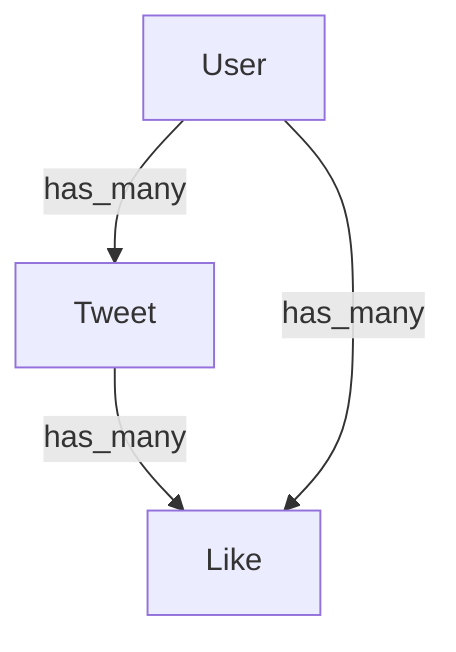

Voici le code de mon schéma Mermaid de ma Database SQL pour ce projet Twitter :

```mermaid
graph TD
erDiagram 
User ||--o{ Tweet : has_many 
Tweet ||--o{ Like : has_many 
User ||--o{ Like : has_many
```




Il y a trois modèles dans l'application Laravel : User, Tweet et Like.
Le modèle User a une relation has_many avec les modèles Tweet et Like.
Le modèle Tweet a une relation has_many avec le modèle Like.
Le modèle Like a une relation belongs_to_many avec les modèles User et Tweet.

2 factories et 2 seeders : 

UserFactory
TweetFactory

view dispo dans l'app:

Feed principal
Profil d'un User
Profil de l'User authentifié
Vue d'un Tweet
Ajout d'un Tweet
Vue qui affiche les tweets ou les users correspond à la recherche


Les contrôleurs sont les suivants :


userController:
- La méthode index récupère un utilisateur en fonction de son ID (passé en paramètre) en utilisant la méthode findOrFail du modèle User. Si l'utilisateur n'est pas trouvé, une erreur 404 sera renvoyée. La méthode retourne ensuite une vue "users.show" en passant l'utilisateur récupéré en paramètre.
- La méthode show récupère également un utilisateur en fonction de son ID en utilisant la méthode findOrFail du modèle User. Elle récupère ensuite les tweets de l'utilisateur triés par ordre chronologique inversé et paginés par groupe de 10 à l'aide de la méthode latest() et de la méthode paginate(). La méthode retourne ensuite une vue "users.show" en passant l'utilisateur récupéré et les tweets en paramètre. La fonction compact permet de créer un tableau associatif en utilisant les noms de variables fournis en paramètre comme clés et les variables elles-mêmes comme valeurs.

tweetController:
- La méthode "index" récupère tous les tweets et les utilisateurs associés, compte le nombre de likes pour chaque tweet, puis effectue une recherche dans les tweets et les utilisateurs en fonction d'une requête de recherche passée dans la requête HTTP. La vue "homepage.index" est ensuite renvoyée avec les tweets récupérés.
- La méthode "show" récupère un tweet et compte le nombre de likes associés, puis renvoie la vue "tweets.show" avec le tweet récupéré.
- La méthode "create" renvoie simplement la vue "tweets.create" qui affiche un formulaire pour créer un nouveau tweet.
- La méthode "store" crée un nouveau tweet à partir des données envoyées dans le formulaire de création de tweet, enregistre l'utilisateur connecté comme l'auteur du tweet, enregistre l'image attachée au tweet (si elle existe) et renvoie l'utilisateur à la page d'accueil.
- La méthode "like" ajoute un like à un tweet donné, à condition que l'utilisateur connecté n'ait pas déjà liké ce tweet. Si l'utilisateur a déjà liké le tweet, la méthode renvoie simplement la vue précédente. La méthode renvoie ensuite l'utilisateur à la vue précédente.

ProfileController:
- show(User $user): Cette méthode récupère l'utilisateur dont l'id est passé en paramètre, puis récupère tous les tweets publiés par cet utilisateur, en les triant par ordre de création décroissant. Elle renvoie la vue de profil en passant les données de l'utilisateur et les tweets.
- edit(Request $request): Cette méthode renvoie la vue de modification de profil en passant les informations de l'utilisateur.
- update(ProfileUpdateRequest $request): Cette méthode met à jour les informations de profil de l'utilisateur en utilisant les données validées fournies dans la requête. Si l'email est modifié, la date de vérification de l'email est supprimée. Si une nouvelle image est téléchargée, elle est sauvegardée dans le dossier de stockage "public/images" et le chemin vers l'image est stocké dans la base de données. La méthode renvoie ensuite une redirection vers la page de modification de profil avec un message de succès.
- destroy(Request $request): Cette méthode supprime le compte de l'utilisateur connecté après la validation de son mot de passe. Elle déconnecte également l'utilisateur, invalide sa session et régénère son jeton CSRF. La méthode renvoie ensuite une redirection vers la page d'accueil.

Enfin, le fichier web.php, celui qui gère la navigation au sein de l'application.


1: Route::get('/', [TweetController::class, 'index'])->name('index');
Cette route permet d'afficher la page d'accueil de l'application. Elle est associée à la méthode index du contrôleur TweetController. Le nom de cette route est index.


2: Route::get('/login', function () { return view('auth.login'); })->name('login');
Cette route permet d'afficher la page de connexion de l'application. Elle est associée à une fonction anonyme qui renvoie la vue auth.login. Le nom de cette route est login.


3: Route::get('/users/{id}', [UserController::class, 'show'])->name('users.show');
Cette route permet d'afficher le profil d'un utilisateur. Elle est associée à la méthode show du contrôleur UserController. Le nom de cette route est users.show.


4: Route::middleware(['auth'])->get('/tweets/create', [TweetController::class, 'create'])->name('tweets.create');
Cette route permet d'afficher le formulaire de création d'un tweet. Elle est associée à la méthode create du contrôleur TweetController et elle nécessite que l'utilisateur soit authentifié pour y accéder. Le nom de cette route est tweets.create.


5: Route::post('/tweets', [TweetController::class, 'store'])->name('tweets.store');
Cette route permet de créer un nouveau tweet en envoyant les données du formulaire de création. Elle est associée à la méthode store du contrôleur TweetController. Le nom de cette route est tweets.store.


6: Route::get('/tweets/{id}', [TweetController::class, 'show'])->name('tweets.show');
Cette route permet d'afficher un tweet en particulier. Elle est associée à la méthode show du contrôleur TweetController. Le nom de cette route est tweets.show.


7: Route::middleware(['auth'])->post('/tweets/{id}/like', [TweetController::class, 'like'])->name('tweets.like');
Cette route permet de "liker" un tweet en envoyant une requête POST. Elle est associée à la méthode like du contrôleur TweetController et nécessite que l'utilisateur soit authentifié pour y accéder. Le nom de cette route est tweets.like.


8: Route::get('/profile/{user}', [ProfileController::class, 'show'])->name('profile.show');
Cette route permet d'afficher le profil d'un utilisateur en particulier. Elle est associée à la méthode show du contrôleur ProfileController. Le nom de cette route est profile.show.


9: Route::get('/dashboard', function () { return view('dashboard'); })->middleware(['auth', 'verified'])->name('dashboard');
Cette route permet d'afficher le tableau de bord de l'application. Elle est associée à une fonction anonyme qui renvoie la vue dashboard et nécessite que l'utilisateur soit authentifié et vérifié pour y accéder. Le nom de cette route est dashboard.


10: Ces routes sont définies à l'intérieur d'un groupe middleware qui exige que l'utilisateur soit authentifié. Cela signifie que seuls les utilisateurs connectés peuvent accéder à ces routes.

La première route, Route::get('/profile', [ProfileController::class, 'edit'])->name('profile.edit');, affiche le formulaire de modification de profil. Lorsqu'un utilisateur soumet ce formulaire, il est redirigé vers la route Route::patch('/profile', [ProfileController::class, 'update'])->name('profile.update'); qui traite les données du formulaire et met à jour les informations du profil de l'utilisateur dans la base de données. Enfin, si l'utilisateur souhaite supprimer son compte, il peut le faire en accédant à la route Route::delete('/profile', [ProfileController::class, 'destroy'])->name('profile.destroy');, qui supprime le compte de l'utilisateur de la base de données.


AccueilController s'occupe d'afficher les Tweets dans un feed principal en sélectionnant tous les Tweets de la DB en méthode index
UserController s'occupe
d'afficher les Utilisateurs du projet en sélectionnant tous les Users de la DB en méthode index
d'afficher les profils de l'Utilisateur sélectionné en méthode show ($id)
ProfilController permet la gestion du profil de l'utilisateur connecté
TweetController permet la création de Tweets (create & edit), l'affichage individuel de ces Tweets (show ($id)), et la gestion de commentaires en rapport avec un Tweet
LikeController permet la gestion des Likes avec un store
Une fois la schématisation, l'implémentation et les liaisons du projet réalisés, il était important de gérer l'affichage grâce à Tailwind. Le projet opte ici pour un affichage en sidenav fixe afin de conserver l'accès aux fonctionnalités (Tweet, Log Out, ...) en toutes circonstances durant la navigation des Tweets.
